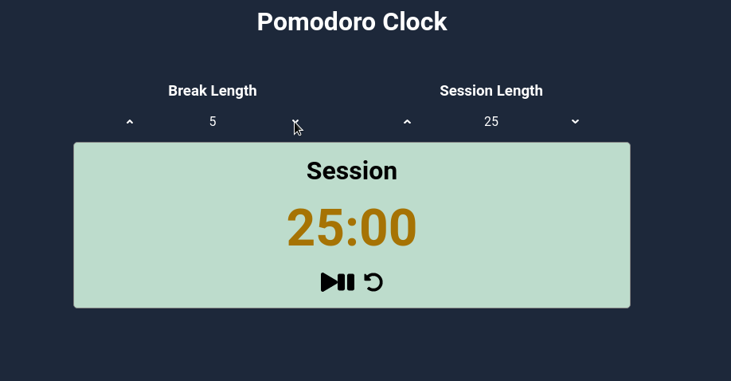

<!-- Badges -->
<p>
  
  <a href="#" target="_blank">
    
  </a>
  <a href="https://twitter.com/redacuve" target="_blank">
    
  </a>
</p>


<!-- Project Header -->
  <p align="center">
    
  <br>
  <h1 align="center">Project Pomodoro Clock</h1>
  <p align="center">
  <br>
   <a href="https://github.com/redacuve/pomodoro-clock"><strong>Explore the repo »</strong></a>
  <br>
    <a href="https://github.com/redacuve/pomodoro-clock/issues">Request Feature</a>
  </p>
  <h2 align="center"><a href="https://mypomodoro-clock.netlify.app/"><strong>Live Link!</strong></a></h2>

<!-- TABLE OF CONTENTS -->

## Table of Contents

* [About the Project](#about-the-project)

* [Built With](#built-with)

* [Getting Started](#getting-started)

* [How it Works](#how-it-works)

* [Contributing](#contributing)

* [License](#license)

* [Contact](#contact)

<!-- ABOUT THE PROJECT -->

## About The Project

This is a simple project build with React.
It's a basic Pomodoro app, you can change the time for every session and break time, by default they are set to 25 minutes per session and 5 per break, you can change maximum to 60 minutes each.
Also, it notifies you when your time ended with a beep sound.
Keep control of time spent on specific activities with the Pomodoro technique.

  <p align="center">
    
  <br>

### Built With

* [React](https://reactjs.org/docs/getting-started.html)

* [HTML5](https://developer.mozilla.org/es/docs/HTML/HTML5)

* [CSS](https://developer.mozilla.org/es/docs/Web/CSS)

* Deployed with
    * [Netlify](https://docs.netlify.com/)

<!-- GETTING STARTED -->
## Getting Started

To get a local copy up and running follow these simple steps.

Clone or fork the <a href="https://github.com/redacuve/pomodoro-clock">repo</a> [git@github.com:redacuve/pomodoro-clock.git]

*note you need have install npm or yarn
* [npm](https://www.npmjs.com/get-npm)
* [yarn](https://classic.yarnpkg.com/en/docs/install)


<!-- HOW IT WORKS -->
## How it Works

Its created with create-react-app. It has a very simplistic and flat design with arrows for selecting the time for the session or the break, it has a beautiful minimalistic display with the time left, and the play/stop button and the reset button. Its build with react and has three main components the Pomodoro app, the display component, and the length box component (where you can change the time for the session or break).
This is the last project to obtain the Front End Libraries Certification by FreeCodeCamp. The other projects are on [CodePen.io](https://codepen.io/redacuve)

### Running the code

*   Navigate to the root directory of the project

*   Run this command on your terminal to run the code locally on http://localhost:3000:
    ```
    $ npm start
    ```
*   Also you can build this app for production, react are going to make a build folder with minified files, and filenames with hashes for best performance
    ```
    $ npm build
    ```
*   You can learn more in the [Create React App documentation](https://facebook.github.io/create-react-app/docs/getting-started).

* To learn React, check out the [React documentation](https://reactjs.org/).

<!-- CONTRIBUTING -->

## Contributing

Contributions are what make the open source community such an amazing place to be learn, inspire, and create. Any contributions you make are **greatly appreciated**.

1. Fork the Project

2. Create your Feature Branch (`git checkout -b feature/AmazingFeature`)

3. Commit your Changes (`git commit -m 'Add some AmazingFeature'`)

4. Push to the Branch (`git push origin feature/AmazingFeature`)

5. Open a Pull Request

<!-- LICENSE -->

## License

This project is under the <a href="https://www.gnu.org/licenses/gpl-3.0.html">GNU Public License V3</a>. For more information see <a href="https://github.com/redacuve/pomodoro-clock/blob/master/LICENSE">here</a>

<!-- CONTACT -->

## Contact

Rey David Cuevas Vela - [@redacuve](https://twitter.com/redacuve) - redacuve@gmail.com -[linkedin.com/in/redacuve/](https://www.linkedin.com/in/redacuve/)

Project Link: [github.com/redacuve/pomodoro-clock](https://github.com/redacuve/pomodoro-clock) - Pomodoro App.